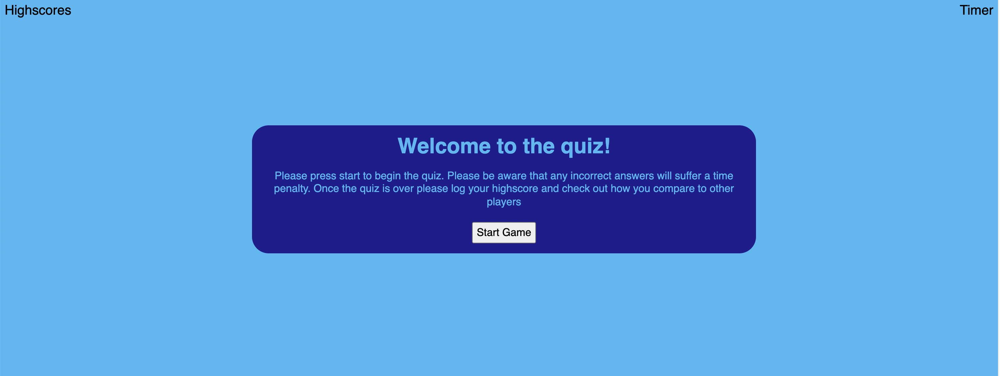
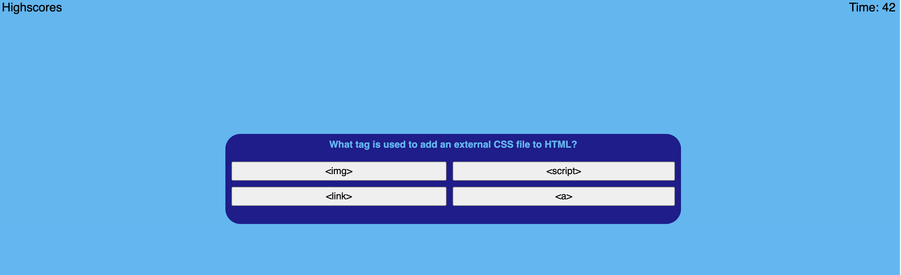
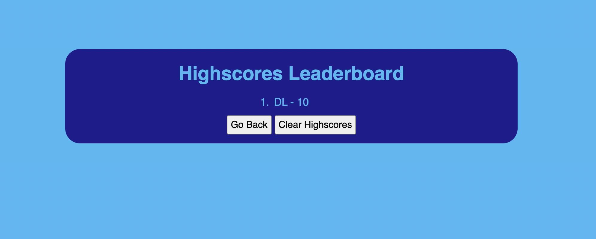

# Coding--Quiz

## Description

- The aim of this project is to create a quiz that is governed by a timer. Once start is pressed the timer will begin and a new question will show. The user then has to select an answer and move on to the next question.
- If the answer is right then they will keep answering until either the timer runs out or all the questions are answered. If the timer is wrong they will move on to the next question but there will be a time penalty.
- Once the game is finished the user's score will be logged in the highscores section using local storage on the browser. The score will be the amount of time that was left.

## Quiz

- The quiz can be found by clicking [deployed project](https://danlawrence91.github.io/Coding--Quiz/)

- The following screenshots show some of the functionality of the quiz as it is working:

- This image is a screenshot of the first page of the quiz where you can either being the quiz or check out the high scores:

- This shows how the question will appear and that the timer has started:

- This shows the final score the user got and how it links to the time left on the clock to get the score:

- This shows the leaderboard with the final score added to it as a list item:

## Future features

- This project can be added to with different questions, or even being able to select questions sets from a group of categories. The style and design of the page can also be changed to make it more aesthetic.
